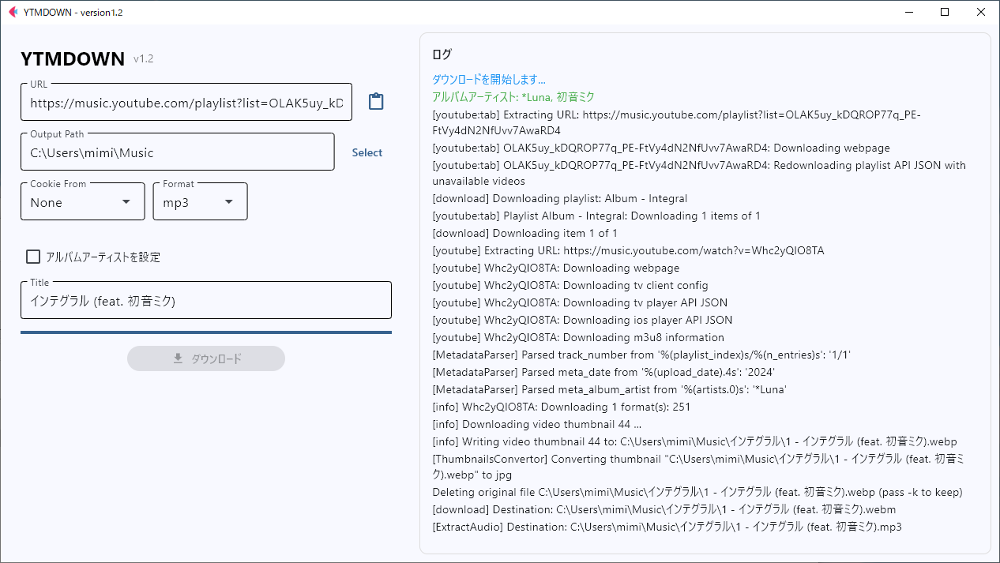
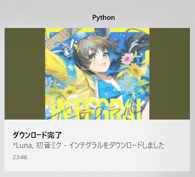

# YTMDOWN
Sprachen: [日本語](README.ja_jp.md) | [English (US)](README.md) | [简体中文](README.zh_cn.md) | [繁體中文](README.zh_tw.md) | [한국어](README.ko_kr.md) | [Français](README.fr_fr.md) | [Deutsch](README.de_de.md) | [Español](README.es_es.md) | [Português (Brasil)](README.pt_br.md) | [Русский](README.ru_ru.md)
Software zum sauberen Herunterladen von Alben aus YouTube Music.

## Über diese Software
Diese App ist eine abgespeckte Version von [samenoko-112/yt-dlpGUI](https://github.com/samenoko-112/yt-dlpGUI),
speziell für YouTube Music.

> [!NOTE]
> Wenn Sie normale Videos herunterladen möchten, verwenden Sie bitte samenoko-112/NeCd.

## Funktionen
### Einfache Einstellungen
Nur URL, Ausgabeverzeichnis, Cookies (optional) und Format!
Es gibt nur eine zusätzliche Option.

### Einstellungen speichern
Ausgabepfad, Cookies und Format werden gespeichert und beim nächsten Start geladen,
damit Sie sie nicht jedes Mal neu einstellen müssen.

### Metadaten
Setzt Titelnummern und Albumkünstler, die nicht automatisch eingebettet werden.
Wenn Sie die Option „Albumkünstler festlegen“ aktivieren, wird der Künstler des ersten Titels als Albumkünstler gesetzt.

### Albumcover
Albumcover wird auf 1:1 zugeschnitten und eingebettet.
Für einige Dateitypen ist mutagen erforderlich.

## Screenshots




## Umgebungen
| OS | Version | .py | Binary |
| -- | --- | - | - |
| Windows10 Pro | 19045.5737 | OK | OK |
| Ubuntu 24.04 | LTS | OK | OK |
| macOS | 15 | OK | OK |

Hinweis: Vorgefertigte ausführbare Dateien werden nur für Windows bereitgestellt.

## Anforderungen
- Python 3.10+
- yt-dlp
    ```shell
    pip install yt-dlp
    ```
- ffmpeg
- mutagen (erforderlich zum Einbetten von Metadaten in einige Dateien)
    ```shell
    pip install mutagen
    ```

## Fehlerbehebung
### Als Virus erkannt
Obwohl der Bootloader beim Build neu erstellt wird, können einige Programme ihn fälschlicherweise erkennen.
Fügen Sie die ausführbare Datei der Ausnahmeliste hinzu oder klonen Sie dieses Repository und bauen Sie es selbst.

### Es treten Fehler auf
Aktualisieren Sie zunächst yt-dlp. Dieses Tool enthält yt-dlp nicht.
```shell
pip install -U yt-dlp
```
Wenn das hilft, umso besser. Download-Protokolle werden im Ordner logs im .txt-Format gespeichert,
Sie können sie mit dem Editor öffnen. Suchen Sie die Fehlermeldung oder fragen Sie eine KI.


