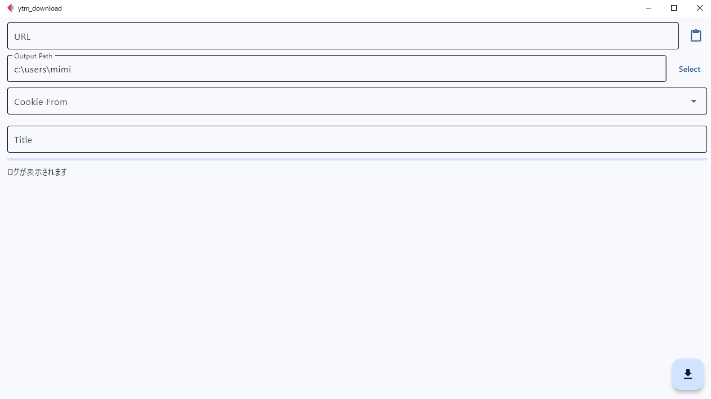
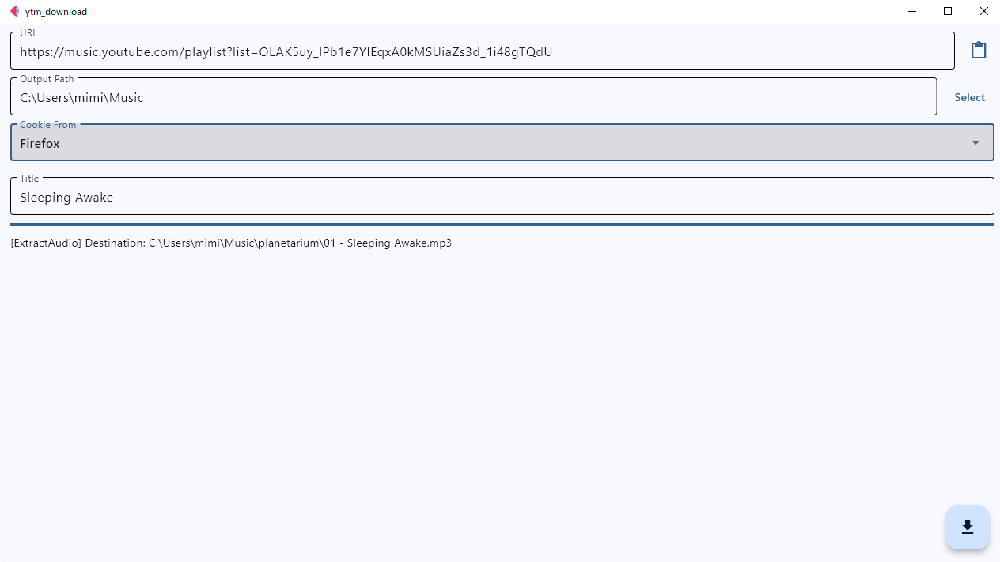

# YTMDOWN
YouTubeMusicからアルバムを良い感じにダウンロードするソフトウェア
## About this Software
[samenoko-112/yt-dlpGUI](https://github.com/samenoko-112/yt-dlpGUI)の機能を削り、  
YouTubeMusicのダウンロードに特化させたソフトウェアです。

## 特徴
- **シンプルな設定**  
    ユーザーが設定できるのはURLと保存先、Cookie**だけです。**  
    フォーマットや品質は固定です。(mp3,自動最高音質)
- **アルバム特化**  
    アルバム名でフォルダを作成、1:1にサムネイルをクロップし埋め込み、トラックナンバーの埋め込みなどを自動で行います。  
    ユーザーが行うべきアクションを減らします。

## 機能
- **Cookieの読み込み**  
    Firefoxからの読み込みと.txtファイルからの読み込みに対応
- **設定の保存**  
    保存先やCookieの設定を保存し、起動時に読み込みます。  
    再設定の手間を省けます。

## 注意点
このソフトウェアはあくまで個人用であり、ダウンロードしたデータは個人で使用するにとどめてください。  
著作権侵害を助長するものではありません。

## スクリーンショット
この画像は古い場合、現行のバージョンと異なる場合があります。

## 導入方法
`YTMDOWN*.exe`を適当なフォルダに配置します。  
`Downloads`フォルダなどはお勧めしません。`logs`フォルダや`config.json`などが生成されるためYTMDOWN用のフォルダを作ることをお勧めします。  
Python,yt-dlp,ffmpegをインストールしたのち実行してください。

インストーラなどは現状ありません。

## 依存関係
このソフトウェアは実行にpython,yt-dlpとffmpegを必要とします。  
またopusやflacなどへのアルバムアートの埋め込みにはmutagenが必要です。