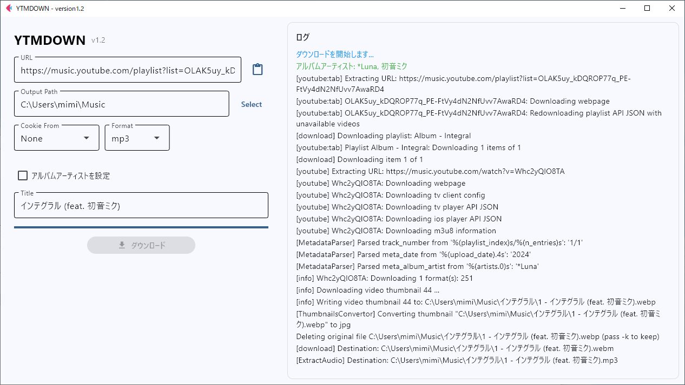
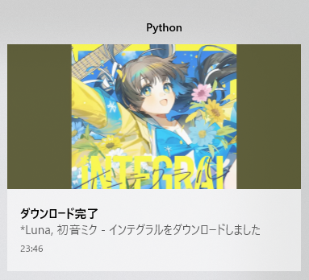

# YTMDOWN
语言: [日本語](README.ja_jp.md) | [English (US)](README.en_us.md) | [简体中文](README.zh_cn.md) | [繁體中文](README.zh_tw.md) | [한국어](README.ko_kr.md) | [Français](README.fr_fr.md) | [Deutsch](README.de_de.md) | [Español](README.es_es.md) | [Português (Brasil)](README.pt_br.md) | [Русский](README.ru_ru.md)
用于从 YouTube Music 优雅地下载专辑的软件。

## 关于本软件
本应用裁剪自 [samenoko-112/yt-dlpGUI](https://github.com/samenoko-112/yt-dlpGUI)，
专注于 YouTube Music 的下载。

> [!NOTE]
> 如果你只是想下载普通视频，建议使用 samenoko-112/NeCd。

## 特点
### 简单设置
只需 URL、保存目录、Cookie（可选）和格式！
仅有一个额外选项。

### 保存设置
保存你的保存路径、Cookie 和格式选择，并在下次启动时加载，
无需每次重新设置。

### 元数据
设置不会自动嵌入的曲目编号和专辑艺术家。
启用“设置专辑艺术家”选项后，将把第一首曲目的艺术家设为专辑艺术家。

### 专辑封面
专辑封面将裁剪为 1:1 并嵌入。
某些文件类型的嵌入需要 mutagen。

## 截图




## 运行环境
| OS | Version | .py | Binary |
| -- | --- | - | - |
| Windows10 Pro | 19045.5737 | OK | OK |
| Ubuntu 24.04 | LTS | OK | OK |
| macOS | 15 | OK | OK |

注：目前仅提供 Windows 的可执行文件。

## 依赖
- Python 3.10+
- yt-dlp
    ```shell
    pip install yt-dlp
    ```
- ffmpeg
- mutagen（部分文件的元数据嵌入需要）
    ```shell
    pip install mutagen
    ```

## 故障排除
### 被报毒
尽管我们在构建时重新构建了引导程序，但部分软件仍可能误报。
请将可执行文件加入白名单，或克隆本仓库自行构建。

### 出现错误
请先尝试更新 yt-dlp。本工具不内置 yt-dlp。
```shell
pip install -U yt-dlp
```
如果能解决就最好。下载日志保存在 logs 文件夹中，.txt 格式，可用记事本打开。
可以尝试搜索错误日志或询问 AI 获取帮助。


